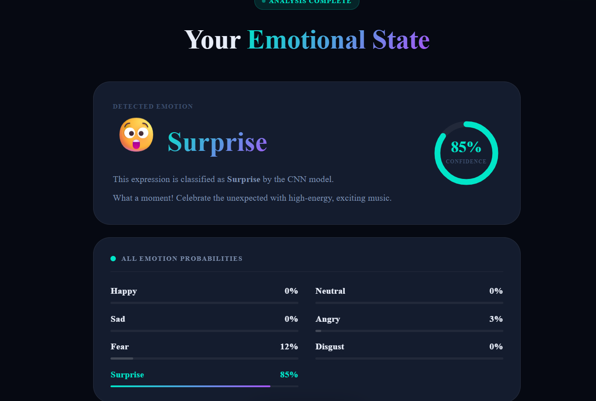
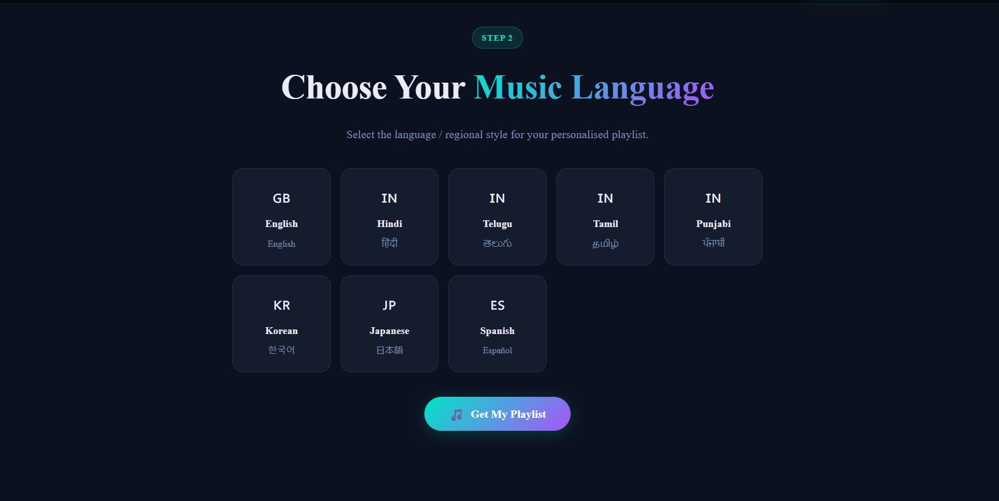

# 🎧 Edge AI Emotion-Based Personalized Music Recommendation System

An AI-powered application that detects **human facial emotions in real-time using Edge AI** and recommends **personalized music playlists** based on the detected emotion.

The system uses **computer vision and a pretrained emotion recognition model** to analyze facial expressions from a webcam. The detected emotion is then mapped to suitable music recommendations using the **Spotify API**.

This project demonstrates the integration of **Edge AI, Computer Vision, and Music Recommendation Systems**.

---

# 📖 Overview

Music preferences often depend on a person’s emotional state. Traditional music platforms recommend songs based on listening history but do not consider the **user's current emotion**.

This project solves that problem by combining:

- Real-time **facial emotion detection**
- **Edge AI inference**
- **Emotion-aware music recommendation**
- **Spotify API integration**

The system captures the user’s facial expression through a webcam and dynamically recommends music based on the detected emotion.

---

# ✨ Key Features

- 🎥 Real-time facial emotion detection using webcam  
- 🤖 Emotion recognition using pretrained CNN model  
- 🧠 Detects **7 human emotions**  
- 🎵 Spotify API based music recommendation  
- 🌍 Multi-language music support  
- ⚡ Edge AI inference for fast processing  
- 📊 Emotion confidence scoring  
- 🎶 Emotion-to-music mapping  
- 🖥 Interactive web interface  

---

# 🧠 Emotion Recognition

The emotion detection system uses a **pretrained CNN model (FER)** trained on the **FER-2013 dataset**.

Detected emotions:

- Happy
- Sad
- Angry
- Surprise
- Fear
- Disgust
- Neutral

The system captures webcam frames using **OpenCV** and predicts emotions in real time.

---

# 🎵 Emotion-Based Music Recommendation

Once the emotion is detected, the system maps it to suitable music moods and retrieves songs using the **Spotify API**.

Example mapping:

| Emotion | Music Mood |
|--------|-------------|
| Happy | Energetic / Upbeat |
| Sad | Calm / Relaxing |
| Angry | Motivational |
| Surprise | Exciting |
| Fear | Comforting |
| Disgust | Neutral |
| Neutral | Balanced |

Spotify audio features used:

- Valence
- Energy
- Tempo

---

# 🏗 System Architecture

The system consists of three main modules:

### 1️⃣ Emotion Detection Module

Handles facial emotion recognition.

Functions:
- Webcam capture
- Face detection
- Emotion classification

Location in project:

backend/emotion/

Files:

detector.py
validation.py

---

### 2️⃣ Music Recommendation Module

Maps emotions to music and retrieves songs from Spotify.

Location:

backend/music/

Files:

emotion_mapper.py
spotify_engine.py

---

### 3️⃣ Backend API

Handles communication between frontend and AI modules.

Location:

backend/

Files:

app.py
config.py

---

### 4️⃣ Frontend Interface

User interface for interaction.

Location:

frontend/

Files:

index.html
learn-more.html
css/style.css
js/app.js

---

# 🔄 System Workflow

1. User opens the web application  
2. Webcam captures facial expressions  
3. Face is detected using OpenCV  
4. Emotion recognition model predicts the emotion  
5. Emotion is mapped to music mood  
6. Spotify API retrieves recommended songs  
7. Songs are displayed in the web interface  

Example 1  
If the system detects **happy emotion**, energetic songs are recommended.

Example 2  
If **sad emotion** is detected, calm and relaxing songs are recommended.

---

# 🛠 Technologies Used

### Programming Languages

- Python
- JavaScript

### AI / Machine Learning

- FER (Facial Emotion Recognition)
- OpenCV
- NumPy
- TensorFlow / PyTorch

### Web Development

- Flask
- HTML
- CSS
- JavaScript

### APIs

- Spotify API
- Spotipy

---

# ⚙️ Installation

## 1 Clone the Repository

git clone https://github.com/yourusername/AI-EMOTION.git

cd AI-EMOTION

---

## 2 Create Virtual Environment

python -m venv venv

Activate environment.

Windows

venv\Scripts\activate

Mac/Linux

source venv/bin/activate

---

## 3 Install Dependencies

pip install -r requirements.txt

---

# ▶️ Run the Application

Start the backend server:

python backend/app.py

Open the frontend:

frontend/index.html

Application runs locally and accesses the webcam for emotion detection.

---

# 📁 Project Structure

AI-EMOTION
│
├── backend
│ ├── emotion
│ │ ├── detector.py
│ │ └── validation.py
│ │
│ ├── music
│ │ ├── emotion_mapper.py
│ │ └── spotify_engine.py
│ │
│ ├── app.py
│ └── config.py
│
├── frontend
│ ├── css
│ │ └── style.css
│ │
│ ├── js
│ │ └── app.js
│ │
│ ├── index.html
│ └── learn-more.html
│
├── venv
└── README.md

---

# 📸 Project Demo

### Emotion Detection Interface

### Language Interface

### Music Recommendation Interface

---

# 🚀 Future Improvements

- Mobile application integration  
- Emotion history tracking  
- AI-generated playlists  
- Edge deployment on Raspberry Pi  
- Improved recommendation algorithm  

---

# 👩‍💻 Author

**D. Sivalekya**  

GitHub  
https://github.com/Sivalekya24

---

# 📜 License

This project is developed for **educational and research purposes**.
